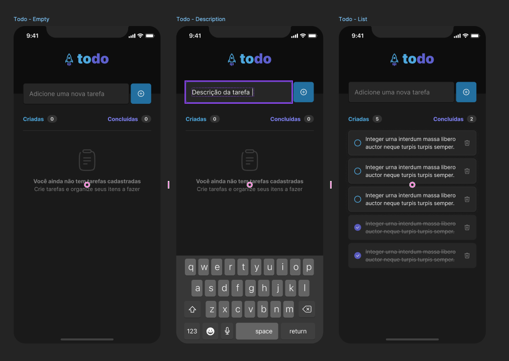

# ToDo

### Objective
O principal objetivo desse projeto é aprender conceitos fundamentais do react native com o curso da Rocketseat.
### Description
- Adicionar uma nova tarefa
- Marcar e desmarcar uma tarefa como concluída
- Remover uma tarefa da listagem
- Mostrar o progresso de conclusão das tarefas

### Concepts
- Estados
- Imutabilidade do estado
- Listas e chaves no React Native
- Propriedades
- Componentização

### Screenshot

<small> Josileudo Rodrigues - 2025 </small>

